# NETRA

### Nama Kelompok

Kelompok Satpam Daring

### Anggota dan NIM

Ketua Kelompok: Fidelya Fredelina - 22/496507/TK/54405
Anggota 1: Argya Sabih Elysio - 23/512630/TK/56335
Anggota 2: Rozan Gangsar Aibrata - 23/521626/TK/57547

### Project Senior Project TI

Departemen Teknologi Elektro dan Teknologi Informasi, Fakultas Teknik, Universitas Gadjah Mada.

**Nama Produk:** Netra

**Jenis produk:** Web-based and AI-powered SIEM with modern monitoring dashboard. Supaya mudah di-deploy dan diakses dari mesin dengan tipe apa saja (cross-platform).

**Latar Belakang:**
Seiring dengan pesatnya perkembangan teknologi, serangan siber semakin marak terjadi dan menjadi salah satu tantangan utama bagi perusahaan dan organisasi di seluruh dunia. Jenis serangan ini bervariasi, mulai dari malware, pencurian identitas, hingga kebocoran data. Dalam sejumlah kasus, serangan ini dapat mengakibatkan kerugian finansial yang signifikan sekaligus mempengaruhi reputasi perusahaan.
Di sisi lain, volume data yang dihasilkan dari monitoring traffic internet perusahaan semakin meningkat dan sering kali bersifat tidak terstruktur. Data yang banyak dan kompleks ini membuat analisis traffic menjadi tugas yang menantang. Perusahaan sering kesulitan membedakan antara traffic yang aman dan traffic yang berbahaya, sehingga lambat dalam merespons potensi ancaman.
Kebanyakan solusi deteksi dan analisis traffic masih mengandalkan sistem berbasis aturan (rule-based systems). Hal ini mengharuskan Security Operations Center (SOC) analyst untuk menentukan dan menerapkan peraturan traffic mereka sendiri, yang bisa memakan waktu dan tidak selalu efektif. Selain itu, pendekatan ini mungkin tidak mampu menangkap taktik serangan yang baru dan terus berkembang, yang bisa berujung pada celah keamanan yang dapat dimanfaatkan oleh penyerang.

**Rumusan Masalah:**

1. Apa saja faktor yang menyebabkan peningkatan frekuensi serangan siber, termasuk tipe serangan seperti malware dan pencurian identitas?
2. Langkah proaktif seperti apa yang harus diambil untuk mendeteksi serangan dengan data tidak terstruktur secara dinamis menggunakan AI?
3. Bagaimana memastikan sistem andal dan dapat diakses ketika dibutuhkan?
4. Bagaimana AI dapat mendeteksi serangan jaringan (DDoS, port scanning brute force, dll) dari data network traffic?
5. Bagaimana mengurangi false positive dan false negative pada sistem deteksi AI?

**Ide Solusi:**
Untuk menghadapi tantangan ini, diperlukan pendekatan yang lebih proaktif dan adaptif dalam analisis traffic. Teknologi seperti machine learning dan analisis big data dapat digunakan untuk mengidentifikasi pola perilaku traffic yang mencurigakan tanpa harus mengandalkan aturan yang ditetapkan secara manual. Teknologi ini di-deploy di cloud network untuk membagi beban analisis dan training traffic. Dengan demikian, organisasi bisa lebih cepat dan efisien dalam mendeteksi dan merespons potensi serangan.

**Analisis Kompetitor:**

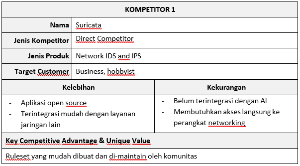
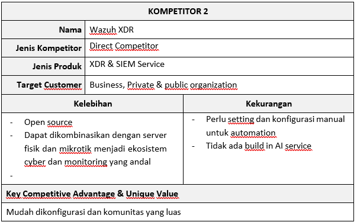
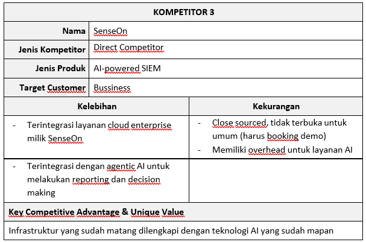

## Worksheet Kelompok Week 2

**Metodologi SDLC**

Metodologi yang digunakan: Agile (Scrum)

Alasan pemilihan metodologi:

- Iterasi Model AI/ML
  Pengembangan deteksi berbasis Machine Learning tidak bisa dilakukan dalam satu kali jalan. Diperlukan proses iteratif untuk melatih (training), menguji, dan menyetel ulang (fine tuning) model AI berdasarkan data traffic terbaru.
- Adaptasi terhadap Ancaman Dinamis
  Tren serangan siber berkembang dengan sangat cepat. Agile memungkinkan tim pengembang untuk merespons dan menambahkan fitur atau pola deteksi baru di setiap sprint tanpa harus mengulang siklus pengembangan dari awal.

**Perancangan Tahap 1-3 SDLC**

Tujuan dari produk: Meningkatkan keamanan jaringan infrastruktur yang dimiliki oleh pengguna

Pengguna potensial dari produk dan kebutuhan para pengguna tersebut:

- Security Operations Center (SOC) Analyst
  Kebutuhan: Membutuhkan dashboard yang bersih dan tidak membingungkan. Mereka perlu AI yang dapat menyaring data tidak terstruktur menjadi peringatan ancaman (alert) yang akurat, serta akses cepat ke detail log untuk melakukan investigasi.

- Network / System Administrator
  Kebutuhan: Membutuhkan visibilitas real-time terhadap lalu lintas jaringan. Karena mereka memiliki mobilitas tinggi, mereka membutuhkan akses cross-platform (bisa diakses via laptop Windows/Mac atau tablet/ponsel) dengan keandalan sistem yang tinggi agar monitoring tidak terputus.

- Chief Information Security Officer (CISO) / IT Security Manager
  Kebutuhan: Membutuhkan ringkasan tingkat tinggi (high-level report) mengenai postur keamanan jaringan perusahaan, metrik jumlah serangan yang berhasil diblokir, dan efisiensi sistem keamanan sebagai bahan pertimbangan keputusan bisnis dan anggaran.

Use Case Diagram:

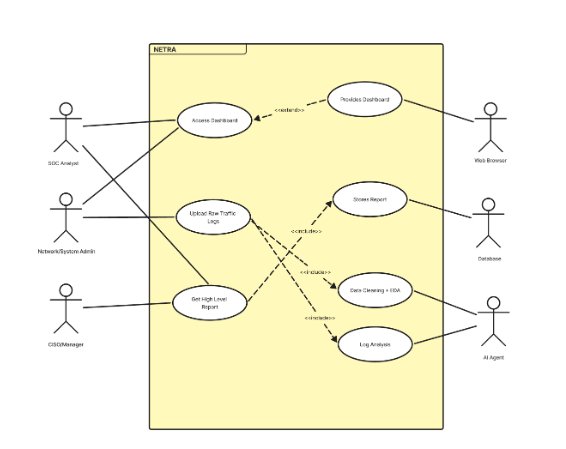

Functional requirements untuk use case yang telah dirancang:

| FR                                      | Deskripsi                                                                                                                                                                                     |
| --------------------------------------- | --------------------------------------------------------------------------------------------------------------------------------------------------------------------------------------------- |
| _Real-time Monitoring_                  | Pengguna masuk ke sistem melalui _web browser_ dan melihat visualisasi _traffic_ jaringan perusahaan secara _real-time_ yang telah dikategorikan (aman vs. mencurigakan).                     |
| Menerima Peringatan Ancaman Berbasis AI | Sistem secara otomatis mengirim pengguna notifikasi (via _dashboard_ atau email) ketika model _Machine Learning_ mendeteksi pola anomali seperti _DDoS_, _port scanning_, atau _brute force_. |
| Menginvestigasi Insiden Keamanan        | Pengguna mengklik sebuah _alert_ ancaman untuk melihat detail data _traffic_ yang terkait, menganalisis IP address asal, dan melihat rekomendasi mitigasi yang dihasilkan oleh sistem.        |

 
Entity Relationship Diagram (ERD):

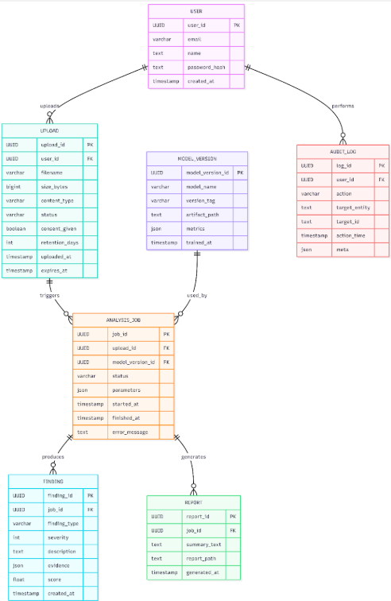

 
Low-Fidelity Wireframe:

- Landing Page

  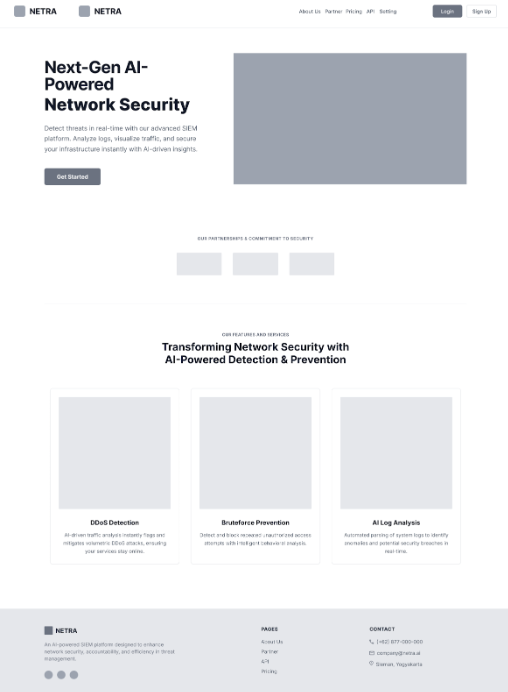

- Monitoring Dashboard

  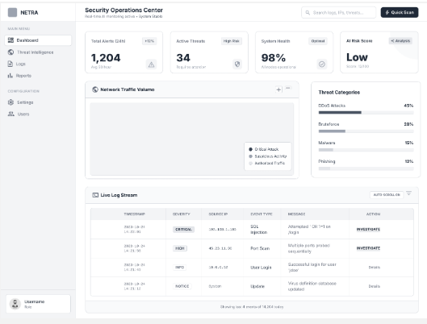

- Network Traffic Log Upload Center

  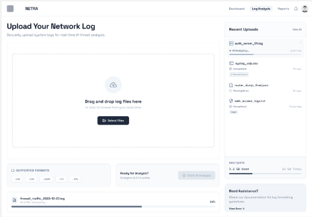

- Register

  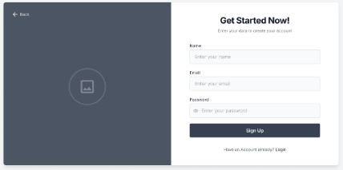

- Login

  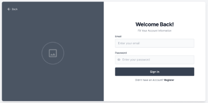

Gantt-Chart pengerjaan proyek dalam kurun waktu 1 semester:

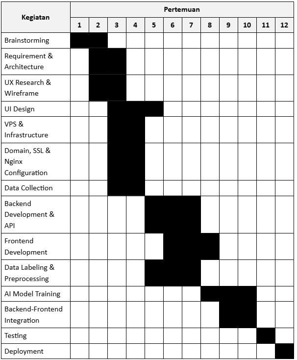
